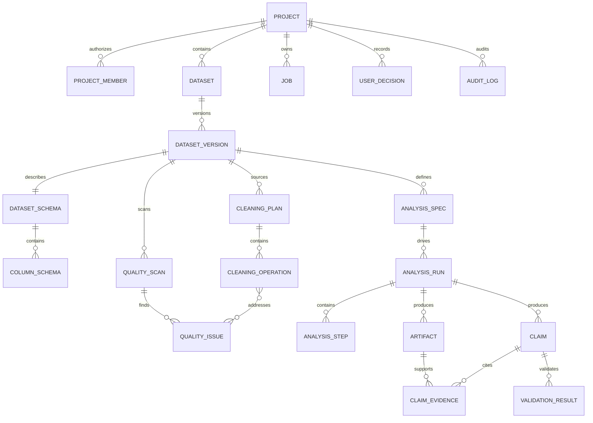

# 数据持久化与数据库设计规范

版本：1.0  
状态：开发基线  
适用实现：Python 3.12、SQLAlchemy 2、Alembic、SQLite、Parquet  
上游契约：[`../api/openapi.yaml`](../api/openapi.yaml)

## 1. 适用范围

本规范定义 AI Data Analyst Agent 的元数据数据库、分析数据文件、产物文件、数据版本、证据链、事务、迁移、索引、归档和测试要求。

它用于指导：

- 后端领域模型和 SQLAlchemy Model；
- Alembic 数据库迁移；
- Repository 和 Service 的持久化边界；
- CSV、Excel、Parquet 接入后的版本管理；
- Job、AnalysisRun、Artifact、Claim 的可追溯实现；
- 数据目录、临时文件、导出文件和清理任务；
- 数据库集成测试、恢复测试和数据一致性测试。

本文件不重新定义前端 API 字段。对外请求、响应、枚举和错误结构仍以 `openapi.yaml` 为准。

发生冲突时，优先级为：

```text
已批准的契约变更
  > openapi.yaml
  > API_INTEGRATION_STANDARD.md
  > 本数据持久化规范
  > 实现代码中的临时约定
```

## 2. 核心决策

### 2.1 存储职责分离

| 存储 | 保存内容 | 不保存内容 |
|---|---|---|
| SQLite | 项目、权限、数据集、版本、Schema、质量问题、清洗计划、分析定义、运行、Job、Artifact 元数据、Claim、审计 | 完整 DataFrame、大型图表二进制、模型二进制、Notebook、报告正文文件 |
| Parquet | 原始规范化数据、清洗数据、建模数据、可导出的明细数据 | 用户权限、运行状态、审批状态 |
| 文件系统 | 原始上传文件、图表、模型、日志、HTML、Notebook、Manifest、临时文件 | 可替代数据库事务状态的“文件名状态” |

数据库负责回答：

```text
对象是什么
→ 属于哪个项目和数据版本
→ 当前状态是什么
→ 由谁、何时、通过什么操作产生
→ 文件位于哪个受控存储键
→ 完整性校验值是什么
```

文件系统负责保存体积较大的实际内容。

### 2.2 MVP 数据库

- MVP 使用 SQLite。
- ORM 使用 SQLAlchemy 2.0 typed declarative mapping。
- 数据库变更只通过 Alembic 执行。
- Repository 不向上层返回裸 SQLAlchemy Session。
- 业务服务不得直接拼接 SQL。
- DuckDB 是 P1 查询增强，不承担系统元数据的事实源职责。

### 2.3 不可变对象

以下对象进入正式状态后禁止原地改写：

- `dataset_versions`：状态进入 `ready` 后，数据文件、哈希、父版本和行列数不可修改；
- `analysis_runs`：运行历史、输入版本和 AnalysisSpec 修订不可替换；
- `artifacts`：状态进入 `ready` 后，内容或校验值变化必须创建新 Artifact；
- 已被 Run 引用的 `analysis_specs` 修订；
- 已记录的用户决策和审计事件。

“当前版本”只是指针，不得用于改写历史对象的绑定关系。

## 3. 标识符、时间与通用字段

### 3.1 标识符

- 所有业务主键使用不透明字符串，不向客户端暴露自增整数。
- 推荐使用带领域前缀的 UUIDv7 或 ULID。
- 标识符在应用层生成，插入数据库前即确定。

| 对象 | 前缀示例 |
|---|---|
| Project | `prj_` |
| Dataset | `ds_` |
| DatasetVersion | `dsv_` |
| QualityIssue | `issue_` |
| CleaningPlan | `cln_` |
| AnalysisSpec | `spec_` |
| AnalysisRun | `run_` |
| Artifact | `art_` |
| Claim | `claim_` |
| Job | `job_` |
| AuditEvent | `audit_` |

### 3.2 时间

- 应用层统一使用带时区 UTC 时间。
- API 使用 ISO 8601 UTC，例如 `2026-07-09T08:30:00Z`。
- SQLite 通过 SQLAlchemy `DateTime(timezone=True)` 映射；读取后必须恢复为 UTC aware datetime。
- 项目时区只用于展示和业务日期解释，不改变数据库存储时区。
- `created_at` 创建后不可修改；`updated_at` 由应用层在成功事务中更新。

### 3.3 通用字段

可编辑聚合根应包含：

- `revision INTEGER NOT NULL DEFAULT 1`；
- `created_at`；
- `updated_at`。

并发更新成功时，必须在同一 SQL 语句或同一事务中：

```text
WHERE id = :id AND revision = :expected_revision
SET ..., revision = revision + 1
```

影响行数为 0 时返回 `412 VERSION_CONFLICT`。

### 3.4 JSON 字段

- JSON 用于结构不固定、无需关系查询的参数、指标、环境摘要和错误详情。
- JSON 中不得存储可正常建模为外键关系的核心关联。
- JSON 字段必须在写入前通过 Pydantic 模型校验。
- JSON 字段必须声明结构版本，例如 `schema_version` 或由生产工具版本确定。
- 不得把大型样例、完整数据列或二进制内容写入 JSON。

## 4. 逻辑数据模型



关系设计原则：

- 所有业务资源都能直接或通过外键链追溯到 `project_id`。
- 高频执行权限校验的表应冗余保存 `project_id`，但必须用服务层不变量确保与父对象一致。
- 多对多关系使用关联表，不在 JSON 数组中保存核心外键。
- 删除策略以归档和限制删除为主，避免证据链被级联删除。

## 5. 表设计

下述字段是持久化基线。实现可以增加内部技术字段，但不得改变 OpenAPI 的对外语义；新增字段必须有明确用途、迁移和测试。

外键与删除规则：

- 业务实体默认使用 `ON DELETE RESTRICT`；
- 正常产品流程只归档，不直接执行物理删除；
- 只有完全依附父对象、不能独立审计的明细行可使用 `ON DELETE CASCADE`，例如关联表和未发布聚合内的操作明细；
- `audit_logs`、`user_decisions`、ready DatasetVersion、AnalysisRun、Artifact、Claim 不得因父对象删除而静默级联删除；
- 经批准的项目物理清除应由专用服务按依赖顺序执行，并写入不包含敏感内容的清除审计。

### 5.1 `projects`

项目是权限、数据和审计的一级隔离边界。

| 字段 | 类型 | 约束 | 说明 |
|---|---|---|---|
| `project_id` | String(40) | PK | `prj_` 前缀业务 ID |
| `name` | String(120) | NOT NULL | 项目名称 |
| `description` | Text | NULL | 项目说明，最大 2000 字符由应用校验 |
| `timezone` | String(64) | NOT NULL | IANA 时区 |
| `language` | String(10) | NOT NULL | `zh-CN` / `en-US` |
| `status` | String(16) | NOT NULL | `active` / `archived` |
| `current_dataset_version_id` | String(40) | FK NULL | 当前版本指针，不代表历史对象输入 |
| `revision` | Integer | NOT NULL | 乐观锁版本 |
| `created_by` | String(160) | NOT NULL | JWT `sub` 或开发身份 |
| `created_at` | DateTime | NOT NULL | UTC |
| `updated_at` | DateTime | NOT NULL | UTC |
| `archived_at` | DateTime | NULL | 归档时间 |

索引与约束：

- `INDEX(status, updated_at)`；
- `current_dataset_version_id` 必须属于本项目；
- 归档项目禁止创建新版本和新运行；
- 项目名称不要求全局唯一。

### 5.2 `project_members`

该表是后端内部权限实现，不要求直接暴露为 MVP API。

| 字段 | 类型 | 约束 | 说明 |
|---|---|---|---|
| `project_id` | String(40) | PK, FK | 所属项目 |
| `subject_id` | String(160) | PK | 身份提供商主体 ID |
| `role` | String(16) | NOT NULL | `owner` / `editor` / `viewer` |
| `created_at` | DateTime | NOT NULL | 授权时间 |
| `created_by` | String(160) | NOT NULL | 授权人 |

约束：

- 一个项目至少保留一个 `owner`；
- 系统管理员不自动获得项目数据明文权限；
- 权限查询不得只依赖前端传入角色。

### 5.3 `datasets`

`Dataset` 表示一个逻辑数据集，实际内容由多个不可变版本承载。

| 字段 | 类型 | 约束 | 说明 |
|---|---|---|---|
| `dataset_id` | String(40) | PK | `ds_` 前缀 |
| `project_id` | String(40) | FK, NOT NULL | 所属项目 |
| `name` | String(255) | NOT NULL | 默认可由安全文件名生成 |
| `source_type` | String(16) | NOT NULL | `csv` / `xls` / `xlsx` / `parquet` |
| `status` | String(16) | NOT NULL | `active` / `archived` |
| `current_version_id` | String(40) | FK NULL | 当前可用版本 |
| `created_by` | String(160) | NOT NULL | 创建人 |
| `created_at` | DateTime | NOT NULL | UTC |
| `archived_at` | DateTime | NULL | 归档时间 |

索引与约束：

- `INDEX(project_id, created_at)`；
- `INDEX(project_id, status)`；
- `current_version_id` 必须属于本数据集且状态为 `ready`；
- 数据集归档不删除版本、运行、证据或文件。

### 5.4 `dataset_versions`

| 字段 | 类型 | 约束 | 说明 |
|---|---|---|---|
| `version_id` | String(40) | PK | `dsv_` 前缀 |
| `dataset_id` | String(40) | FK, NOT NULL | 所属逻辑数据集 |
| `project_id` | String(40) | FK, NOT NULL | 冗余项目 ID，用于隔离查询 |
| `version_number` | Integer | NOT NULL | 数据集内递增，从 1 开始 |
| `parent_version_id` | String(40) | FK NULL | 父版本；原始版本为空 |
| `status` | String(16) | NOT NULL | `creating` / `ready` / `failed` / `archived` |
| `kind` | String(16) | NOT NULL | `raw` / `cleaned` / `modeled` |
| `source_file_name` | String(255) | NOT NULL | 仅展示，不作为存储名 |
| `source_type` | String(16) | NOT NULL | 文件类型 |
| `sheet_name` | String(255) | NULL | Excel Sheet |
| `parse_options_json` | JSON | NOT NULL | 编码、分隔符、表头、日期提示等 |
| `source_storage_key` | Text | NOT NULL | 原始文件相对存储键 |
| `data_storage_key` | Text | NULL | 成功版本的 Parquet 存储键 |
| `file_hash` | String(71) | NOT NULL | 该版本主数据文件校验值；raw 记录上传源文件，衍生版本记录生成的 Parquet |
| `data_checksum` | String(71) | NULL | 规范化 Parquet 校验值 |
| `file_size_bytes` | BigInteger | NOT NULL | 原始文件大小 |
| `row_count` | BigInteger | NOT NULL | 数据行数 |
| `column_count` | Integer | NOT NULL | 列数 |
| `operation_summary` | Text | NULL | 创建原因摘要 |
| `created_by` | String(160) | NOT NULL | 上传或执行用户 |
| `created_at` | DateTime | NOT NULL | UTC |
| `ready_at` | DateTime | NULL | 成功提交时间 |
| `failure_code` | String(64) | NULL | 稳定错误码 |
| `failure_detail_json` | JSON | NULL | 已脱敏诊断信息 |

索引与约束：

- `UNIQUE(dataset_id, version_number)`；
- `INDEX(project_id, created_at)`；
- `INDEX(dataset_id, status, version_number)`；
- `INDEX(file_hash)` 用于重复文件提示，不自动合并不同项目数据；
- `parent_version_id` 必须属于同一 `dataset_id`；
- `kind=raw` 时 `parent_version_id IS NULL`；
- `status=ready` 时 `data_storage_key`、`data_checksum`、`ready_at` 必填；
- ready 版本的业务字段不可更新，只允许归档状态变更。

### 5.5 `dataset_schemas`

保存版本级 Schema 修订信息。

| 字段 | 类型 | 约束 | 说明 |
|---|---|---|---|
| `schema_id` | String(40) | PK | 内部 ID |
| `dataset_version_id` | String(40) | FK, UNIQUE | 一个版本一个当前 Schema 聚合根 |
| `project_id` | String(40) | FK, NOT NULL | 项目隔离 |
| `revision` | Integer | NOT NULL | 用户覆盖时递增 |
| `low_confidence_count` | Integer | NOT NULL | 低置信度字段数 |
| `inference_version` | String(64) | NOT NULL | 推断规则/模型版本 |
| `created_at` | DateTime | NOT NULL | UTC |
| `updated_at` | DateTime | NOT NULL | UTC |

### 5.6 `column_schemas`

| 字段 | 类型 | 约束 | 说明 |
|---|---|---|---|
| `column_schema_id` | String(40) | PK | 内部 ID |
| `schema_id` | String(40) | FK, NOT NULL | 所属 Schema |
| `dataset_version_id` | String(40) | FK, NOT NULL | 便于按版本读取 |
| `position` | Integer | NOT NULL | 原始列顺序 |
| `name` | String(255) | NOT NULL | 原始字段名 |
| `physical_type` | String(24) | NOT NULL | OpenAPI 枚举 |
| `semantic_type` | String(32) | NOT NULL | OpenAPI 枚举 |
| `analysis_role` | String(24) | NOT NULL | OpenAPI 枚举 |
| `confidence` | Numeric(5,4) | NOT NULL | 0–1 |
| `evidence_json` | JSON | NOT NULL | 推断证据字符串数组 |
| `date_format` | String(80) | NULL | 日期解析格式 |
| `ordinal_values_json` | JSON | NULL | 有序类别顺序 |
| `sensitive` | Boolean | NOT NULL | 是否敏感 |
| `sensitivity_type` | String(32) | NULL | email/phone/id/name/address/other |
| `user_confirmed` | Boolean | NOT NULL | 用户是否确认 |
| `confirmed_by` | String(160) | NULL | 确认人 |
| `confirmed_at` | DateTime | NULL | 确认时间 |
| `profile_json` | JSON | NOT NULL | 非空数、唯一数、长度、分位数等受限摘要 |
| `created_at` | DateTime | NOT NULL | UTC |
| `updated_at` | DateTime | NOT NULL | UTC |

索引与约束：

- `UNIQUE(dataset_version_id, name)`；
- `UNIQUE(dataset_version_id, position)`；
- `INDEX(dataset_version_id, analysis_role)`；
- `confidence BETWEEN 0 AND 1`；
- `profile_json` 不保存无界高基数值列表；
- 敏感示例不得写入 `profile_json`。

### 5.7 `quality_scans`

质量扫描是一次有规则版本的确定性执行。

| 字段 | 类型 | 约束 | 说明 |
|---|---|---|---|
| `scan_id` | String(40) | PK | 内部扫描 ID |
| `project_id` | String(40) | FK, NOT NULL | 项目 |
| `dataset_version_id` | String(40) | FK, NOT NULL | 输入版本 |
| `analysis_spec_id` | String(40) | FK NULL | 增强泄露检查的任务上下文 |
| `job_id` | String(40) | FK, NOT NULL | 执行 Job |
| `rules_json` | JSON | NOT NULL | 规则列表和参数 |
| `ruleset_version` | String(64) | NOT NULL | 规则集版本 |
| `status` | String(16) | NOT NULL | `queued` / `running` / `succeeded` / `failed` |
| `started_at` | DateTime | NULL | UTC |
| `completed_at` | DateTime | NULL | UTC |
| `created_at` | DateTime | NOT NULL | UTC |

索引：`INDEX(dataset_version_id, created_at)`。

### 5.8 `quality_issues`

| 字段 | 类型 | 约束 | 说明 |
|---|---|---|---|
| `issue_id` | String(40) | PK | `issue_` 前缀 |
| `scan_id` | String(40) | FK, NOT NULL | 来源扫描 |
| `project_id` | String(40) | FK, NOT NULL | 项目 |
| `dataset_version_id` | String(40) | FK, NOT NULL | 数据版本 |
| `issue_type` | String(64) | NOT NULL | 稳定规则类型 |
| `column_name` | String(255) | NULL | 相关字段 |
| `severity` | String(16) | NOT NULL | `low` / `medium` / `high` / `critical` |
| `status` | String(16) | NOT NULL | `open` / `accepted` / `resolved` / `ignored` |
| `title` | String(255) | NOT NULL | 用户可读标题 |
| `explanation` | Text | NOT NULL | 风险解释 |
| `metrics_json` | JSON | NOT NULL | 确定性指标 |
| `sample_rows_json` | JSON | NOT NULL | 有上限且脱敏的样例 |
| `recommendation` | Text | NULL | 建议 |
| `decision_reason` | Text | NULL | 忽略/接受原因 |
| `revision` | Integer | NOT NULL | 乐观锁 |
| `created_at` | DateTime | NOT NULL | UTC |
| `updated_at` | DateTime | NOT NULL | UTC |
| `resolved_at` | DateTime | NULL | 解决时间 |

索引与约束：

- `INDEX(dataset_version_id, severity, status)`；
- `INDEX(project_id, created_at)`；
- `ignored` 必须有 `decision_reason`；
- `resolved` 只能由执行成功的处置或明确的重新扫描结果产生；
- `metrics_json` 是事实，AI 解释不得覆盖它。

### 5.9 `cleaning_plans`

| 字段 | 类型 | 约束 | 说明 |
|---|---|---|---|
| `plan_id` | String(40) | PK | `cln_` 前缀 |
| `project_id` | String(40) | FK, NOT NULL | 项目 |
| `source_version_id` | String(40) | FK, NOT NULL | 输入版本 |
| `result_version_id` | String(40) | FK NULL | 成功执行产生的版本 |
| `name` | String(120) | NOT NULL | 计划名称 |
| `status` | String(24) | NOT NULL | OpenAPI CleaningPlan 状态 |
| `preview_artifact_id` | String(40) | FK NULL | 预览产物 |
| `decision` | String(16) | NULL | `approve` / `reject` |
| `decision_reason` | Text | NULL | 决策原因 |
| `decided_by` | String(160) | NULL | 决策人 |
| `decided_at` | DateTime | NULL | 决策时间 |
| `revision` | Integer | NOT NULL | 乐观锁 |
| `created_by` | String(160) | NOT NULL | 创建人 |
| `created_at` | DateTime | NOT NULL | UTC |
| `updated_at` | DateTime | NOT NULL | UTC |

索引与约束：

- `INDEX(project_id, source_version_id, status)`；
- 仅 `approved` 可进入 `executing`；
- `executed` 时 `result_version_id` 必填且必须为 `ready`；
- 已执行计划不可修改操作列表；
- 失败重试创建新 Job，保留原失败记录。

### 5.10 `cleaning_operations`

| 字段 | 类型 | 约束 | 说明 |
|---|---|---|---|
| `operation_id` | String(40) | PK | 契约中的操作 ID |
| `plan_id` | String(40) | FK, NOT NULL | 所属计划 |
| `position` | Integer | NOT NULL | 执行顺序 |
| `operation` | String(40) | NOT NULL | 白名单操作类型 |
| `column_name` | String(255) | NULL | 目标字段 |
| `parameters_json` | JSON | NOT NULL | 经操作专属 Schema 校验 |
| `reason` | Text | NOT NULL | 处理理由 |
| `estimated_affected_rows` | BigInteger | NULL | 预估影响 |
| `actual_affected_rows` | BigInteger | NULL | 实际影响 |
| `risk_level` | String(16) | NOT NULL | `low` / `medium` / `high` |
| `reversible` | Boolean | NOT NULL | 操作本身是否可逆 |
| `status` | String(16) | NOT NULL | `pending` / `succeeded` / `failed` / `skipped` |
| `before_summary_json` | JSON | NULL | 执行前摘要 |
| `after_summary_json` | JSON | NULL | 执行后摘要 |
| `error_json` | JSON | NULL | 已脱敏错误 |

约束：

- `UNIQUE(plan_id, position)`；
- `operation` 必须存在于 Cleaning Tool Registry；
- `column_name` 必须存在于 `source_version_id` 的 Schema，允许无列操作除外；
- 正式执行与预览必须调用同一确定性函数。

### 5.11 `cleaning_operation_issues`

| 字段 | 类型 | 约束 | 说明 |
|---|---|---|---|
| `operation_id` | String(40) | PK, FK | 清洗操作 |
| `issue_id` | String(40) | PK, FK | 对应质量问题 |

该表替代 `issue_ids` 的数据库 JSON 存储；API 层可聚合为数组。

### 5.12 `analysis_specs`

| 字段 | 类型 | 约束 | 说明 |
|---|---|---|---|
| `spec_id` | String(40) | PK | `spec_` 前缀 |
| `project_id` | String(40) | FK, NOT NULL | 项目 |
| `dataset_version_id` | String(40) | FK, NOT NULL | 定义所针对版本 |
| `name` | String(120) | NOT NULL | 名称 |
| `revision` | Integer | NOT NULL | 修订号 |
| `status` | String(16) | NOT NULL | `draft` / `confirmed` / `superseded` |
| `task` | String(40) | NOT NULL | OpenAPI 枚举 |
| `target` | String(255) | NULL | 目标字段 |
| `entity_key` | String(255) | NULL | 实体键 |
| `time_column` | String(255) | NULL | 时间字段 |
| `prediction_time_description` | Text | NULL | 预测时点 |
| `split_strategy` | String(24) | NOT NULL | OpenAPI 枚举 |
| `group_column` | String(255) | NULL | Group 拆分字段 |
| `metrics_json` | JSON | NOT NULL | 指标字符串数组 |
| `included_columns_json` | JSON | NOT NULL | 明确纳入字段 |
| `excluded_columns_json` | JSON | NOT NULL | 排除字段 |
| `random_seed` | Integer | NOT NULL | 默认 42 |
| `causal_interpretation_allowed` | Boolean | NOT NULL | MVP 固定为 false |
| `validation_warnings_json` | JSON | NOT NULL | 确认时仍保留的警告 |
| `created_by` | String(160) | NOT NULL | 创建人 |
| `created_at` | DateTime | NOT NULL | UTC |
| `updated_at` | DateTime | NOT NULL | UTC |

索引与约束：

- `INDEX(project_id, dataset_version_id, status)`；
- `target`、`entity_key`、`time_column`、`group_column` 和列数组必须引用版本 Schema 中存在的字段；
- `confirmed` 后若已有 Run 引用，不得原地修改；创建新修订并将旧修订标记 `superseded`；
- 运行记录必须绑定具体 `spec_id` 和 `revision`。

### 5.13 `analysis_runs`

| 字段 | 类型 | 约束 | 说明 |
|---|---|---|---|
| `run_id` | String(40) | PK | `run_` 前缀 |
| `project_id` | String(40) | FK, NOT NULL | 项目 |
| `dataset_version_id` | String(40) | FK, NOT NULL | 输入版本 |
| `analysis_spec_id` | String(40) | FK, NOT NULL | 分析定义 |
| `analysis_spec_revision` | Integer | NOT NULL | 冻结修订号 |
| `source_run_id` | String(40) | FK NULL | 重跑来源 |
| `job_id` | String(40) | FK, UNIQUE | 对应 Job |
| `run_kind` | String(16) | NOT NULL | `eda` / `analysis` / `model` / `full` |
| `status` | String(16) | NOT NULL | OpenAPI AnalysisRun 状态 |
| `progress` | Integer | NOT NULL | 0–100 |
| `current_step_id` | String(40) | FK NULL | 当前步骤 |
| `random_seed` | Integer | NOT NULL | 随机种子 |
| `environment_json` | JSON | NOT NULL | Python、依赖、工具和代码版本摘要 |
| `error_json` | JSON | NULL | 终态错误 |
| `created_by` | String(160) | NOT NULL | 发起人 |
| `created_at` | DateTime | NOT NULL | UTC |
| `started_at` | DateTime | NULL | UTC |
| `completed_at` | DateTime | NULL | UTC |

索引与约束：

- `INDEX(project_id, created_at)`；
- `INDEX(dataset_version_id, status)`；
- `progress BETWEEN 0 AND 100`；
- Run、Spec 和 DatasetVersion 必须属于同一项目；
- Run 输入版本在创建后不可替换；
- 终态：`blocked`、`succeeded`、`failed`、`cancelled`；
- 重试和重跑创建新 Run，不复用旧 `run_id`。

### 5.14 `analysis_steps`

| 字段 | 类型 | 约束 | 说明 |
|---|---|---|---|
| `step_id` | String(40) | PK | 步骤 ID |
| `run_id` | String(40) | FK, NOT NULL | 所属运行 |
| `position` | Integer | NOT NULL | 从 1 开始 |
| `name` | String(160) | NOT NULL | 步骤名 |
| `tool_name` | String(120) | NULL | 注册工具名 |
| `tool_version` | String(64) | NULL | 工具版本 |
| `status` | String(16) | NOT NULL | OpenAPI AnalysisStep 状态 |
| `input_parameters_json` | JSON | NOT NULL | 已验证输入 |
| `code_storage_key` | Text | NULL | 受控代码或等价代码路径 |
| `log_storage_key` | Text | NULL | 已清理日志路径 |
| `error_json` | JSON | NULL | 错误 |
| `started_at` | DateTime | NULL | UTC |
| `completed_at` | DateTime | NULL | UTC |

约束：

- `UNIQUE(run_id, position)`；
- 工具名和版本必须能在 Tool Registry 中解析；
- 步骤成功前，全部必要 Artifact 必须成功写入；
- 运行状态应由步骤状态和编排结果统一推进。

### 5.15 `artifacts`

| 字段 | 类型 | 约束 | 说明 |
|---|---|---|---|
| `artifact_id` | String(40) | PK | `art_` 前缀 |
| `project_id` | String(40) | FK, NOT NULL | 项目 |
| `run_id` | String(40) | FK, NOT NULL | 来源运行 |
| `step_id` | String(40) | FK NULL | 来源步骤 |
| `dataset_version_id` | String(40) | FK, NOT NULL | 输入数据版本 |
| `type` | String(24) | NOT NULL | OpenAPI Artifact 类型 |
| `name` | String(255) | NOT NULL | 展示名称 |
| `producer` | String(120) | NOT NULL | 生产工具 |
| `producer_version` | String(64) | NOT NULL | 工具版本 |
| `status` | String(16) | NOT NULL | `creating` / `ready` / `failed` / `expired` |
| `parameters_json` | JSON | NOT NULL | 生成参数 |
| `result_json` | JSON | NULL | 小型结构化结果 |
| `preview_json` | JSON | NULL | 前端安全预览 |
| `storage_key` | Text | NULL | 大型内容相对存储键 |
| `content_type` | String(120) | NULL | MIME 类型 |
| `size_bytes` | BigInteger | NULL | 文件大小 |
| `checksum` | String(71) | NOT NULL | 文件或规范化结果校验值 |
| `downloadable` | Boolean | NOT NULL | 是否允许导出 |
| `created_at` | DateTime | NOT NULL | UTC |
| `ready_at` | DateTime | NULL | 完成时间 |
| `expired_at` | DateTime | NULL | 过期时间 |
| `failure_detail_json` | JSON | NULL | 已脱敏错误 |

索引与约束：

- `INDEX(run_id, type, status)`；
- `INDEX(project_id, dataset_version_id)`；
- `ready` 时必须存在 `result_json` 或 `storage_key`；
- `storage_key` 不得是用户可控的绝对路径；
- Artifact 与 Run 必须绑定同一 `dataset_version_id`；
- 校验值不匹配时不得返回下载地址。

### 5.16 `claims`

| 字段 | 类型 | 约束 | 说明 |
|---|---|---|---|
| `claim_id` | String(40) | PK | `claim_` 前缀 |
| `project_id` | String(40) | FK, NOT NULL | 项目 |
| `run_id` | String(40) | FK, NOT NULL | 来源运行 |
| `dataset_version_id` | String(40) | FK, NOT NULL | 证据版本 |
| `text` | Text | NOT NULL | 结论文本 |
| `level` | Integer | NOT NULL | 1–5 |
| `limitations_json` | JSON | NOT NULL | 限制条件数组 |
| `validation_status` | String(16) | NOT NULL | `pending` / `passed` / `failed` |
| `validation_messages_json` | JSON | NOT NULL | 验证消息 |
| `publication_status` | String(16) | NOT NULL | `draft` / `published` / `withdrawn` |
| `created_at` | DateTime | NOT NULL | UTC |
| `validated_at` | DateTime | NULL | 验证时间 |
| `published_at` | DateTime | NULL | 发布时间 |
| `withdrawn_at` | DateTime | NULL | 撤回时间 |
| `withdrawal_reason` | Text | NULL | 撤回原因 |

约束：

- `level BETWEEN 1 AND 5`；
- `INDEX(run_id, validation_status, publication_status)`；
- `published` 必须满足 `validation_status=passed`；
- 正式 Claim 至少有一条 `claim_evidences`；
- Claim、Run、Artifact 必须属于同一项目；
- 非比较型 Claim 不得跨数据版本引用证据。

### 5.17 `claim_evidences`

| 字段 | 类型 | 约束 | 说明 |
|---|---|---|---|
| `claim_id` | String(40) | PK, FK | 结论 |
| `artifact_id` | String(40) | PK, FK | 证据 |
| `position` | Integer | NOT NULL | 展示顺序 |
| `evidence_role` | String(32) | NOT NULL | `primary` / `supporting` / `limitation` |
| `reference_json` | JSON | NULL | 指标键、表格单元或图表系列引用 |
| `created_at` | DateTime | NOT NULL | UTC |

API 的 `evidence_ids` 由该表聚合生成，不在 `claims` 表重复保存。

### 5.18 `validation_results`

| 字段 | 类型 | 约束 | 说明 |
|---|---|---|---|
| `validation_id` | String(40) | PK | 验证记录 ID |
| `claim_id` | String(40) | FK, NOT NULL | 被验证 Claim |
| `validator_name` | String(120) | NOT NULL | 验证器 |
| `validator_version` | String(64) | NOT NULL | 版本 |
| `validation_type` | String(64) | NOT NULL | 字段、数字、单位、方向、版本、敏感信息等 |
| `status` | String(16) | NOT NULL | `passed` / `failed` / `skipped` |
| `expected_json` | JSON | NULL | 预期 |
| `actual_json` | JSON | NULL | 实际 |
| `message` | Text | NULL | 说明 |
| `created_at` | DateTime | NOT NULL | UTC |

Claim 的总体状态由必需验证器结果确定，不允许直接由 LLM 写成 `passed`。

### 5.19 `jobs`

| 字段 | 类型 | 约束 | 说明 |
|---|---|---|---|
| `job_id` | String(40) | PK | `job_` 前缀 |
| `project_id` | String(40) | FK, NOT NULL | 项目 |
| `kind` | String(32) | NOT NULL | OpenAPI Job kind |
| `status` | String(16) | NOT NULL | OpenAPI Job 状态 |
| `progress` | Integer | NOT NULL | 0–100 |
| `current_step` | String(160) | NULL | 当前阶段 |
| `resource_type` | String(64) | NULL | 结果资源类型 |
| `resource_id` | String(40) | NULL | 结果资源 ID |
| `request_json` | JSON | NOT NULL | 归一化任务输入，不含密钥 |
| `retry_after_ms` | Integer | NULL | 轮询建议 |
| `lease_owner` | String(160) | NULL | Worker 标识 |
| `lease_expires_at` | DateTime | NULL | 租约到期时间 |
| `heartbeat_at` | DateTime | NULL | 最近心跳 |
| `cancel_requested_at` | DateTime | NULL | 取消请求时间 |
| `error_json` | JSON | NULL | ErrorDetail |
| `created_by` | String(160) | NOT NULL | 发起用户 |
| `created_at` | DateTime | NOT NULL | UTC |
| `updated_at` | DateTime | NOT NULL | UTC |
| `started_at` | DateTime | NULL | UTC |
| `completed_at` | DateTime | NULL | UTC |

索引与约束：

- `INDEX(status, created_at)`；
- `INDEX(project_id, kind, created_at)`；
- `progress BETWEEN 0 AND 100`；
- Worker 通过短事务获取租约，不长时间持有数据库事务；
- 启动恢复任务扫描租约过期的 `running/cancelling` Job，并按任务能力恢复或标记失败；
- `failed`、`cancelled`、`blocked`、`succeeded` 为终态。

### 5.20 `idempotency_keys`

| 字段 | 类型 | 约束 | 说明 |
|---|---|---|---|
| `subject_id` | String(160) | PK | 用户主体 |
| `method` | String(8) | PK | HTTP 方法 |
| `path` | String(500) | PK | 归一化路径 |
| `idempotency_key` | String(160) | PK | 客户端键 |
| `request_hash` | String(71) | NOT NULL | 规范化请求体哈希 |
| `resource_type` | String(64) | NULL | 创建结果类型 |
| `resource_id` | String(40) | NULL | 创建结果 ID |
| `job_id` | String(40) | FK NULL | 异步任务 |
| `response_status` | Integer | NULL | 已完成响应状态 |
| `response_json` | JSON | NULL | 可安全重放的小型响应 |
| `created_at` | DateTime | NOT NULL | UTC |
| `expires_at` | DateTime | NOT NULL | 默认 24 小时 |

相同键但 `request_hash` 不同，返回 `409 IDEMPOTENCY_CONFLICT`。

### 5.21 `user_decisions`

| 字段 | 类型 | 约束 | 说明 |
|---|---|---|---|
| `decision_id` | String(40) | PK | 决策 ID |
| `project_id` | String(40) | FK, NOT NULL | 项目 |
| `subject_id` | String(160) | NOT NULL | 决策人 |
| `object_type` | String(64) | NOT NULL | Schema、Issue、Plan、Spec、Claim 等 |
| `object_id` | String(40) | NOT NULL | 目标 ID |
| `action` | String(64) | NOT NULL | confirm/ignore/approve/reject/publish 等 |
| `before_json` | JSON | NULL | 修改前受限快照 |
| `after_json` | JSON | NULL | 修改后受限快照 |
| `reason` | Text | NULL | 理由 |
| `created_at` | DateTime | NOT NULL | UTC |

决策事件只追加，不更新和删除。

### 5.22 `audit_logs`

| 字段 | 类型 | 约束 | 说明 |
|---|---|---|---|
| `audit_id` | String(40) | PK | `audit_` 前缀 |
| `project_id` | String(40) | FK NULL | 系统事件可为空 |
| `subject_id` | String(160) | NULL | 操作主体 |
| `action` | String(80) | NOT NULL | 稳定动作名 |
| `object_type` | String(64) | NULL | 对象类型 |
| `object_id` | String(40) | NULL | 对象 ID |
| `result` | String(16) | NOT NULL | `success` / `denied` / `failed` |
| `request_id` | String(80) | NULL | 关联 API 日志 |
| `ip_hash` | String(71) | NULL | 需要时保存加盐哈希，不默认保存明文 IP |
| `summary_json` | JSON | NOT NULL | 不含敏感原值的操作摘要 |
| `error_code` | String(64) | NULL | 稳定错误码 |
| `created_at` | DateTime | NOT NULL | UTC |

索引：

- `INDEX(project_id, created_at)`；
- `INDEX(request_id)`；
- `INDEX(object_type, object_id, created_at)`。

审计日志不可作为普通业务更新对象。

## 6. P1 数据表

以下能力不阻塞首个 MVP 纵向切片：

- `conversations`；
- `messages`；
- `conversation_summaries`；
- 数据集跨版本统计快照；
- DuckDB 查询缓存；
- 报告模板和定时任务。

启用前必须单独增加 Alembic 迁移，并同步评审隐私、保留期和 API 契约。对话正文不得进入普通产品埋点。

## 7. 状态机与数据不变量

### 7.1 DatasetVersion

```text
creating → ready
         → failed
ready    → archived
```

- `ready` 和 `failed` 之间不能互相转换；
- 失败重试创建新版本记录；
- 文件生成成功但数据库提交失败时，文件必须进入孤儿清理流程；
- 数据库标记 `ready` 前必须完成文件移动、校验和验证与 Parquet 可读性验证。

### 7.2 CleaningPlan

```text
draft → awaiting_approval → approved → executing → executed
                         ↘ rejected              ↘ failed
```

- 未批准不得执行；
- 修改已批准计划必须退回 `draft` 并清除旧批准；
- `executed` 必须关联一个新的 ready DatasetVersion；
- `failed` 不得留下可激活的半成品版本。

### 7.3 Job

```text
queued → running → succeeded
                 ↘ failed
                 ↘ blocked
queued/running → cancelling → cancelled
```

- Job 状态必须持久化；
- 进程重启后不能长期保留无租约的 `running`；
- 业务终态不自动回退；
- 重试创建新 Job，并可通过内部字段关联来源 Job。

### 7.4 AnalysisRun

```text
queued → running → succeeded
                 ↘ failed
                 ↘ blocked
queued/running → cancelled
```

- `succeeded` 前所有必需步骤必须成功；
- `failed/blocked/cancelled` 的已生成 Artifact 可以保留，但必须标注状态和适用范围；
- 新数据版本重跑创建新 Run；
- 历史 Run 始终绑定创建时的数据版本和 AnalysisSpec 修订。

### 7.5 Claim

```text
draft + pending
  → draft + passed
  → draft + failed

draft + passed → published
published → withdrawn
```

- 无证据不得 `passed`；
- 验证失败不得 `published`；
- 撤回不删除 Claim 或证据；
- Artifact 过期或损坏时，相关已发布 Claim 必须被重新验证或撤回。

## 8. 文件与目录规范

`DATA_ROOT` 下建议使用以下结构：

```text
data/
├── app.db
├── originals/
│   └── {project_id}/{dataset_id}/{version_id}/source.{ext}
├── versions/
│   └── {project_id}/{dataset_id}/{version_id}/data.parquet
├── artifacts/
│   └── {project_id}/{run_id}/{artifact_id}/
│       ├── content
│       └── manifest.json
├── exports/
│   └── {project_id}/{job_id}/
├── logs/
│   └── {project_id}/{run_id}/{step_id}.log
├── tmp/
│   └── {job_id}/
└── quarantine/
```

规则：

- 数据库只保存相对于 `DATA_ROOT` 的 `storage_key`；
- API 不返回内部路径，只通过受权下载接口返回临时 URL；
- 路径由后端根据 ID 生成，不拼接用户文件名；
- 解析和执行先写入 `tmp/{job_id}`；
- 校验成功后使用同一文件系统内的原子移动提交；
- `originals` 和 `versions` 中的 ready 内容只读；
- 隔离失败、哈希不符和无法判定归属的文件进入 `quarantine`；
- 定期清理过期临时文件、导出文件和数据库不存在的孤儿文件；
- 清理前必须确认没有活动 Job 持有该目录租约。

## 9. 数据版本创建事务

数据版本创建不得用单个长事务包住文件解析。

推荐流程：

1. 短事务创建 `dataset_versions(status=creating)` 和 Job。
2. 将上传流写入 Job 临时目录，同时计算 SHA-256。
3. 校验大小、扩展名、内容特征和安全文件名。
4. 解析并将规范化数据写为临时 Parquet。
5. 重新读取 Parquet，验证 Schema、行列数和校验和。
6. 将原始文件和 Parquet 原子移动到正式目录。
7. 短事务写入文件存储键、哈希、行列数和 Schema，并将版本改为 `ready`。
8. 更新 Dataset/Project 当前版本指针。
9. 提交成功后再清理临时目录。

任何步骤失败：

- Job 进入 `failed`；
- DatasetVersion 进入 `failed`；
- 不更新当前版本指针；
- 正式目录中的未引用文件由孤儿清理任务处理；
- 错误日志不得包含原始敏感值、密钥或用户可控绝对路径。

## 10. SQLite 运行配置

每个连接必须启用：

```sql
PRAGMA foreign_keys = ON;
PRAGMA busy_timeout = 5000;
```

建议生产型单机部署启用：

```sql
PRAGMA journal_mode = WAL;
PRAGMA synchronous = NORMAL;
```

规则：

- Web 请求和 Worker 使用独立 Session；
- Session 生命周期不得跨请求或跨线程共享；
- 不在事务中执行大文件上传、模型训练或 LLM 调用；
- 写事务保持短小；
- 获取 Job 使用租约和条件更新，不能依赖进程内锁；
- SQLite 写入争用超过基线时，应评估 PostgreSQL，而不是关闭一致性约束。

## 11. SQLAlchemy 与 Repository 规范

建议目录：

```text
backend/app/
├── domain/
│   ├── models/
│   ├── enums/
│   └── errors.py
├── persistence/
│   ├── orm/
│   ├── repositories/
│   ├── session.py
│   └── unit_of_work.py
├── services/
└── workers/
backend/migrations/
```

必须遵守：

- ORM Model、API Pydantic Model 和领域对象分离；
- API 不直接序列化 ORM 对象；
- Repository 方法必须带项目范围或在加载后立即执行项目归属校验；
- Repository 不接受任意 `order_by` 字符串，排序字段使用白名单；
- 关联集合默认避免无界 eager loading；
- 列表接口只选择需要的列并分页；
- 读取 Artifact 内容必须经过 Storage Service，不直接打开数据库中的路径；
- Service 负责状态机和跨 Repository 不变量；
- Unit of Work 负责事务提交与回滚；
- 数据库异常转换为稳定领域错误，API 层再映射为契约错误码。

## 12. Alembic 迁移规范

- 禁止在应用启动时执行 `metadata.create_all()` 代替迁移。
- 每次 Schema 变化创建独立 Alembic revision。
- revision 名称应说明领域，例如 `create_dataset_version_tables`。
- 迁移必须同时提供 `upgrade()` 和可行的 `downgrade()`。
- 破坏性变更采用“扩展—迁移—切换—清理”，不在一个版本直接删列。
- 新增 NOT NULL 字段时先允许空值或提供安全默认，再回填并收紧约束。
- 枚举值变化必须同步：
  - OpenAPI；
  - API 契约变更记录；
  - 数据库约束；
  - SQLAlchemy 枚举；
  - 前端生成类型；
  - 状态机测试。
- 迁移前备份 `app.db`；迁移后执行版本、外键和关键查询自检。
- 已发布迁移文件不得重写；修正通过新迁移完成。

## 13. 数据安全与隐私

- 数据库和文件目录不得位于静态 Web 根目录。
- 原始文件名仅用于展示，进入日志前进行控制字符清理。
- `sample_rows_json`、`profile_json`、`preview_json` 必须执行脱敏和数量限制。
- 密钥、Bearer Token、数据库口令不得写入任何表、JSON、日志或 Manifest。
- 对外错误不得返回 `storage_key`、系统绝对路径或 SQL。
- 下载前同时验证用户身份、项目权限、Artifact 状态、校验和和敏感字段策略。
- 备份与导出遵循与在线数据相同的访问控制。
- 删除项目时先归档；物理清除需要单独的受审计流程。

## 14. 备份、保留与清理

MVP 默认策略：

- 项目归档不立即物理删除；
- ready DatasetVersion、正式 Artifact、已发布 Claim 和审计日志长期保留，直到项目清除流程批准；
- 临时目录在 Job 终态后保留不超过 24 小时；
- 导出文件按下载过期时间清理；
- 幂等键默认保留 24 小时；
- 失败 Job 日志的保留期由部署配置决定；
- 清理任务只能删除数据库明确标记过期或无法引用的对象。

备份至少覆盖：

- `app.db`；
- `originals/`；
- `versions/`；
- 未过期且不可重新生成的 `artifacts/`；
- 当前 Alembic revision。

恢复演练必须验证数据库记录、文件存储键和校验和的一致性。

## 15. 查询与性能基线

- 所有项目列表查询必须带 `project_id` 或权限连接条件。
- API 普通列表使用页码分页；大数据预览使用稳定 cursor。
- 不使用 `OFFSET` 对 Parquet 明细进行深分页。
- 数据预览按列裁剪、行数限制和敏感字段掩码执行。
- SQLite 查询避免对 JSON 内容做高频全表扫描；需要筛选的值建成普通列。
- 质量问题、Job、Run、Artifact 和 Claim 的常用组合条件必须有索引。
- 写入大量 ColumnSchema、QualityIssue 时使用受控批量写入，但事务内仍执行外键和唯一性校验。

首轮必须用 `EXPLAIN QUERY PLAN` 检查：

- 项目下数据集列表；
- 数据集版本链；
- Job 轮询；
- 版本质量问题筛选；
- Run 的步骤和 Artifact；
- Claim 及其证据。

## 16. 测试要求

### 16.1 单元测试

- ID 和时间生成；
- 状态机合法/非法迁移；
- JSON 模型校验；
- Storage Key 生成和路径穿越防护；
- 乐观锁冲突；
- Claim 发布条件。

### 16.2 Repository 集成测试

- 外键和唯一约束；
- 项目隔离；
- 归档过滤；
- 分页、排序和筛选；
- revision 条件更新；
- 事务失败回滚；
- Session 不泄漏；
- 数据库重开后对象仍可读取。

### 16.3 文件一致性测试

- 上传中断不产生 ready 版本；
- Parquet 写入失败不更新当前版本；
- 哈希不符不能下载；
- 数据库提交失败产生的孤儿文件可被发现；
- 临时文件清理不影响运行中 Job；
- 备份恢复后校验和一致。

### 16.4 并发与恢复测试

- 同一幂等键重复请求返回同一资源；
- 同一幂等键不同请求返回冲突；
- 两个客户端更新相同 revision 时仅一个成功；
- Worker 崩溃后租约过期 Job 可恢复或进入明确终态；
- SQLite busy 场景返回可诊断错误，不产生部分提交。

### 16.5 迁移测试

- 空数据库可升级到最新 revision；
- 上一个发布版本可原地升级；
- downgrade 在声明支持的范围内可执行；
- 迁移后外键检查通过；
- 迁移不修改 ready DatasetVersion 的业务内容。

## 17. 监控与审计指标

至少采集：

- 数据库连接和写事务失败数；
- SQLite busy/locked 次数和等待时间；
- Job 队列长度、租约过期数和遗留 running 数；
- DatasetVersion 创建成功率、失败阶段和耗时；
- Artifact 写入、校验失败和孤儿文件数；
- 数据库文件、Parquet、Artifact、临时目录占用；
- 清理任务删除量、失败量和跳过原因；
- Alembic 当前 revision；
- 跨项目访问拒绝事件。

指标标签不得包含原始字段值、文件名、用户问题全文或敏感列名。

## 18. 数据契约变更流程

变更分为三类：

- 仅内部 Schema：不改变 API，但需要 Alembic 迁移和 Repository 测试；
- 对外兼容变更：先更新 OpenAPI 和契约变更记录，再增加数据库字段；
- 破坏性变更：提升 API 主版本或提供兼容期，并采用扩展—迁移—切换—清理。

变更请求必须说明：

```text
变更标题：
涉及表：
涉及 OpenAPI Schema / operationId：
新增或修改字段：
默认值与回填方案：
索引影响：
锁表和磁盘影响：
升级方案：
回滚方案：
前端影响：
后端影响：
数据保留与隐私影响：
```

## 19. 实施顺序

第一轮 `BE-003` 只实现可运行纵向切片所需基线：

1. Session、Unit of Work 和 Alembic；
2. `projects`、`project_members`；
3. `datasets`、`dataset_versions`；
4. `jobs`、`idempotency_keys`；
5. Repository 基础、项目隔离和乐观锁；
6. 文件 Storage Service、临时目录和原子提交；
7. 集成测试和迁移测试。

随后按开发计划增加：

```text
Schema
→ Quality
→ Cleaning
→ AnalysisSpec / Run
→ Artifact / Claim
→ Export / Retention
```

不允许在第一轮提前创建大量未被当前纵向切片使用、且缺少迁移测试的空表。

## 20. 完成定义

数据持久化任务只有同时满足以下条件才算完成：

- Alembic migration 可从空数据库升级；
- SQLAlchemy Model、领域对象和 API Schema 分离；
- Repository 实现项目隔离、分页、排序白名单和乐观锁；
- 外键、唯一约束、检查约束和必要索引已创建；
- 状态机非法迁移被服务层阻断；
- ready DatasetVersion 和 Artifact 的不可变规则有测试；
- 上传/执行失败不会提交可用半成品；
- Job 重启恢复和幂等测试通过；
- 文件路径不可由用户控制，下载不暴露内部路径；
- 数据库与文件校验和一致性测试通过；
- OpenAPI 契约测试通过；
- 日志、审计和错误响应不包含敏感原值；
- 对应任务在 `../development/PROJECT_STATUS.md` 中更新状态。
