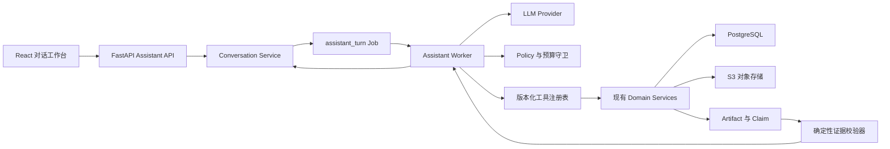

# 大模型能力扩展实施计划

版本：1.0
状态：执行中（Gate L0、Gate L1 已完成）
适用范围：DataTrace AI Data Analyst Agent
依赖基线：`PROD-001` 至 `PROD-014` 已完成
契约入口：[`../api/openapi.yaml`](../api/openapi.yaml)
主任务入口：[`PARALLEL_DEVELOPMENT_PLAN.md`](PARALLEL_DEVELOPMENT_PLAN.md)

## 1. 目标与成功标准

本阶段把现有“证据优先的数据分析工作台”扩展为可对话、可规划、可调用真实分析工具的
AI Data Analyst。大模型负责理解问题、生成受约束计划、选择工具和解释结果；pandas、
SciPy、scikit-learn、数据库和现有 Worker 负责计算、持久化与验证。

上线后必须满足以下业务结果：

1. 用户能用自然语言提出数据问题，并得到基于当前项目、数据版本和真实 Artifact 的回答。
2. 每个数字、模型指标和统计结论都能定位到 Artifact/Claim，不由大模型自行生成。
3. 大模型可以提出分析、清洗和建模计划，但写数据、启动计算或改变版本前必须经过确认。
4. 会话、模型调用、工具调用、Token 用量、失败原因和用户确认均可审计。
5. 模型不可用时，现有上传、清洗、EDA、建模和报告功能仍可正常使用。
6. 真实数据默认不直接发送给外部模型；上下文遵循最小化、脱敏和项目权限隔离。

首个生产版本的量化门槛：

| 指标 | 门槛 |
|---|---|
| 标准问题端到端成功率 | 不低于 90% |
| 有数字回答的有效证据覆盖率 | 100% |
| 跨项目数据泄露测试 | 0 次 |
| 未确认写操作执行次数 | 0 次 |
| 大模型故障对核心分析链路影响 | 核心链路仍可用 |
| 普通问答 P95 完成时间 | 不高于 30 秒，不含模型训练 |
| 单次 Turn 工具调用上限 | 默认 8 次，可配置 |
| 单次 Turn 模型调用上限 | 默认 4 次，可配置 |

## 2. 范围边界

### 2.1 本阶段包含

- OpenAI-compatible 大模型 Provider 和可替换 Provider 接口；
- 结构化输出、超时、重试、限流、预算、降级和调用审计；
- 证据型报告叙述；
- 项目内多轮对话；
- 自然语言问题到受约束分析计划；
- 只读数据上下文、Artifact、Claim 和 Schema 检索工具；
- 经用户确认的 AnalysisSpec、分析运行和清洗计划创建；
- 清洗、特征工程和建模建议；
- 证据引用校验、提示注入防护和敏感数据控制；
- 管理端可观测指标和生产部署配置。

### 2.2 本阶段明确不包含

- 让大模型直接计算统计指标或模型指标；
- 允许大模型执行任意 Python、Shell 或 SQL；
- 允许大模型直接写 PostgreSQL 或对象存储；
- 未经确认自动执行清洗、激活数据版本或启动高成本建模；
- 把相关性自动描述为因果关系；
- 将原始敏感列、完整数据集或对象存储签名地址发送给模型；
- 第一版实现多 Agent 群组、向量数据库或自训练基础模型；
- 用模型供应商的会话状态替代本项目数据库中的会话事实源。

## 3. 不可破坏的设计原则

### 3.1 计算与叙述分离

```text
用户问题
→ LLM 生成结构化计划
→ 后端校验权限、字段和预算
→ 白名单工具执行真实计算
→ Artifact / Claim 持久化并验证
→ LLM 仅基于已验证证据组织回答
```

- Prompt 中出现的数字不能直接成为正式 Claim。
- LLM 输出的 `citation_ids` 必须引用当前项目和当前可见数据版本的 Artifact/Claim。
- 含数字、比较方向或显著性描述的回答必须通过确定性引用校验器。
- Claim 的 `validation_status` 仍由验证器决定，LLM 无权写成 `passed`。

### 3.2 工具优先，不开放任意代码

Agent 只能调用注册表中的版本化工具。第一版工具分为三类：

| 类别 | 示例 | 是否需要确认 |
|---|---|---|
| 读取 | 读取 Schema、质量问题、Artifact、Claim、运行状态 | 否 |
| 草拟 | 草拟 AnalysisSpec、清洗计划、报告结构 | 否 |
| 执行 | 创建分析运行、执行清洗、激活版本、导出报告 | 是 |

工具参数必须使用 Pydantic Schema 校验；工具内部调用 Service 层，不允许绕过 Repository、
项目权限、状态机或审计。

### 3.3 数据最小化

默认发送给模型的上下文只包含：

- 项目名称、语言、时区；
- 数据版本 ID、行列数和版本说明；
- Schema、语义类型、角色、缺失率等聚合画像；
- 已脱敏的小样本，且仅在任务确实需要时加入；
- Artifact 摘要、已验证 Claim 和限制条件；
- 当前用户问题及必要的最近会话摘要。

默认不发送原始文件、完整列、对象存储地址、用户凭证、Cookie、内部路径和日志堆栈。

## 4. 目标架构



建议新增后端目录：

```text
backend/app/llm/
├── provider.py             # Provider Protocol 与统一请求/响应
├── openai_compatible.py    # HTTP 适配器，不绑定具体供应商 SDK
├── schemas.py              # 结构化输出 Schema
├── prompts.py              # 版本化 Prompt 注册表
├── context.py              # 权限内上下文构建与脱敏
├── policy.py               # 工具、预算、隐私和确认策略
├── tools.py                # Agent 工具注册表
├── citations.py            # 引用与数字一致性校验
└── orchestrator.py         # 单 Turn 状态机

backend/app/services/
└── assistant.py

backend/app/workers/
└── assistant.py

backend/app/api/routes/
└── assistant.py

frontend/src/features/assistant/
├── AssistantPage.tsx
├── ConversationPanel.tsx
├── AnalysisPlan.tsx
├── ToolActivity.tsx
├── EvidenceReferences.tsx
└── AssistantFeedback.tsx
```

## 5. Provider 与配置设计

### 5.1 Provider 接口

业务层只依赖统一接口，不直接依赖供应商 SDK：

```python
class LLMProvider(Protocol):
    def generate_structured(
        self,
        *,
        messages: list[LLMMessage],
        response_schema: type[BaseModel],
        model: str,
        temperature: float,
        timeout_seconds: int,
    ) -> LLMResponse: ...
```

统一响应至少包含：`provider`、`model`、`request_id`、`content`、`usage`、
`finish_reason`、`latency_ms`。供应商原始响应不得完整写入普通日志。

首版采用 OpenAI-compatible HTTP 协议；后续增加其他供应商时只新增 Adapter。不得让前端
接触 API Key。

### 5.2 环境变量

```text
LLM_ENABLED=false
LLM_PROVIDER=openai_compatible
LLM_API_BASE=https://provider.example/v1
LLM_API_KEY=secret-managed-value
LLM_MODEL=provider-model-name
LLM_TEMPERATURE=0.1
LLM_TIMEOUT_SECONDS=120
LLM_MAX_OUTPUT_TOKENS=4096
LLM_MAX_INPUT_TOKENS=24000
LLM_MAX_CALLS_PER_TURN=4
LLM_MAX_TOOL_CALLS_PER_TURN=8
LLM_MAX_RETRIES=2
LLM_DAILY_TOKEN_BUDGET_PER_USER=200000
LLM_ALLOW_MASKED_SAMPLES=false
LLM_RETENTION_DAYS=30
```

要求：

- `LLM_ENABLED=false` 时应用可启动，`natural_language_analysis=false`；
- `LLM_ENABLED=true` 时启动阶段只校验配置格式，readiness 执行短超时连通性检查；
- API Key 只从运行环境读取，不写数据库、Job `request_json`、Artifact 或日志；
- ModelScope 部署时通过创空间密文变量配置；不能把已有 Studio Token 当作模型名或 API 地址；
- 支持为开发、测试和生产配置不同模型，不在源码硬编码模型名称。

## 6. 数据模型与迁移

新增迁移时必须同时支持 PostgreSQL 与 SQLite 测试，并更新
[`../data/DATA_PERSISTENCE_STANDARD.md`](../data/DATA_PERSISTENCE_STANDARD.md)。

### 6.1 `assistant_conversations`

| 字段 | 约束与说明 |
|---|---|
| `conversation_id` | PK，`conv_` 前缀 |
| `project_id` | FK，必填，所有访问按项目隔离 |
| `title` | 最长 160，由首问生成，可编辑 |
| `status` | `active` / `archived` |
| `dataset_version_id` | 可空；锁定会话默认分析版本 |
| `summary` | 可空；压缩后的会话摘要，不含密钥 |
| `created_by` | 用户主体 |
| `created_at` / `updated_at` / `archived_at` | UTC |

索引：`(project_id, updated_at)`、`(created_by, status, updated_at)`。

### 6.2 `assistant_messages`

| 字段 | 约束与说明 |
|---|---|
| `message_id` | PK，`msg_` 前缀 |
| `conversation_id` | FK，删除会话时限制或软删除 |
| `role` | `user` / `assistant` / `system_event` / `tool` |
| `status` | `queued` / `processing` / `awaiting_confirmation` / `completed` / `failed` / `cancelled` |
| `content` | 用户或最终回答；不得存储密钥 |
| `content_json` | 结构化计划、引用和展示块 |
| `parent_message_id` | 支持重试和分支 |
| `created_by` | 用户或系统主体 |
| `created_at` / `completed_at` | UTC |

索引：`(conversation_id, created_at)`。内容长度设置上限，禁止无界写入。

### 6.3 `llm_runs`

| 字段 | 约束与说明 |
|---|---|
| `llm_run_id` | PK，`llmr_` 前缀 |
| `message_id` / `project_id` | FK，必填 |
| `job_id` | FK，可空 |
| `provider` / `model` | 实际使用的供应商和模型 |
| `prompt_name` / `prompt_version` | Prompt 可追溯版本 |
| `status` | `queued` / `running` / `awaiting_confirmation` / `succeeded` / `failed` / `cancelled` |
| `input_tokens` / `output_tokens` | 非负整数 |
| `model_call_count` / `tool_call_count` | 预算计数 |
| `latency_ms` | 总耗时 |
| `context_manifest_json` | 只记录资源 ID、版本、脱敏策略，不保存密钥 |
| `error_json` | 安全错误信息 |
| 时间字段 | UTC |

索引：`(project_id, created_at)`、`(status, created_at)`、`(provider, model, created_at)`。

### 6.4 `llm_tool_calls`

| 字段 | 约束与说明 |
|---|---|
| `tool_call_id` | PK，`tcall_` 前缀 |
| `llm_run_id` | FK，必填 |
| `tool_name` / `tool_version` | 白名单工具和版本 |
| `status` | `proposed` / `approved` / `running` / `succeeded` / `failed` / `rejected` |
| `requires_confirmation` | 布尔值 |
| `arguments_json` | 通过 Schema 校验后的参数，不含密钥 |
| `result_reference_json` | 资源 ID、Job ID、Artifact ID；不复制大型结果 |
| `approved_by` / `approved_at` | 高风险调用必填 |
| `error_json` | 安全错误信息 |
| 时间字段 | UTC |

唯一约束：`(llm_run_id, provider_tool_call_id)`，防止重试造成重复执行。

### 6.5 `assistant_feedback`

存储用户对回答的 `helpful` / `not_helpful` 评价、原因枚举和可选说明。反馈仅用于评估，
不能自动改变 Prompt 或放宽工具权限。

### 6.6 Job 扩展

- 新增 `assistant_turn` Job kind；同步更新 ORM CheckConstraint、OpenAPI 枚举和 Worker Runner。
- 长模型调用不在数据库事务中执行。
- Worker 先获取短租约，模型调用期间定期心跳，完成后短事务写结果。
- 等待用户确认时，Assistant Turn 为 `awaiting_confirmation`，Job 进入现有 `blocked` 终态；
  确认请求创建新的续跑 Job，避免长期持有租约。

## 7. API 契约草案

实际开发必须先修改 `openapi.yaml` 和 `CONTRACT_CHANGELOG.md`，以下 operationId 为计划基线：

| Method | Path | operationId | 说明 |
|---|---|---|---|
| GET | `/projects/{project_id}/assistant/conversations` | `listAssistantConversations` | 分页列出会话 |
| POST | `/projects/{project_id}/assistant/conversations` | `createAssistantConversation` | 创建会话并锁定可选数据版本 |
| GET | `/projects/{project_id}/assistant/conversations/{conversation_id}` | `getAssistantConversation` | 获取会话元数据 |
| PATCH | `/projects/{project_id}/assistant/conversations/{conversation_id}` | `updateAssistantConversation` | 标题、归档、数据版本 |
| GET | `/projects/{project_id}/assistant/conversations/{conversation_id}/messages` | `listAssistantMessages` | Cursor 分页读取消息 |
| POST | `/projects/{project_id}/assistant/conversations/{conversation_id}/messages` | `createAssistantMessage` | 创建 Turn，返回 Message + Job |
| POST | `/projects/{project_id}/assistant/messages/{message_id}/confirm` | `confirmAssistantPlan` | 确认或拒绝受控工具调用 |
| POST | `/projects/{project_id}/assistant/messages/{message_id}/retry` | `retryAssistantMessage` | 基于原问题创建新 Turn |
| POST | `/projects/{project_id}/assistant/messages/{message_id}/cancel` | `cancelAssistantMessage` | 请求取消 |
| POST | `/projects/{project_id}/assistant/messages/{message_id}/feedback` | `createAssistantFeedback` | 提交回答反馈 |

契约要求：

- 创建消息必须支持 `Idempotency-Key`；
- 所有路径执行项目成员校验；
- 响应不返回 Prompt、API Key、内部模型请求体或对象存储地址；
- `AssistantAnswer` 分块返回 `summary`、`findings`、`limitations`、`next_actions`、
  `citations`，而不是只返回一段 Markdown；
- `AssistantPlan` 必须包含步骤、工具、风险、预计成本和是否需要确认；
- 前端继续复用现有 `Job` 轮询，流式输出作为后续非阻塞增强。

## 8. Prompt、工具与回答 Schema

### 8.1 Prompt 注册表

Prompt 作为代码中的版本化模板维护，名称示例：

- `assistant.intent@1.0.0`
- `assistant.plan@1.0.0`
- `assistant.answer@1.0.0`
- `assistant.report_narrative@1.0.0`
- `assistant.cleaning_advice@1.0.0`
- `assistant.modeling_advice@1.0.0`

每次 `llm_run` 记录名称和版本。Prompt 修改必须有单元测试和离线评估，不允许在生产数据库中
无审查地热更新。

### 8.2 首版工具清单

| 工具 | 行为 | 权限/风险 |
|---|---|---|
| `project.get_context@1` | 读取项目、当前数据版本 | 只读 |
| `schema.get@1` | 读取字段画像、语义类型、角色 | 只读 |
| `quality.list_issues@1` | 读取质量问题摘要 | 只读 |
| `data.get_masked_sample@1` | 获取受限脱敏样本 | 只读，策略控制 |
| `artifact.search@1` | 按类型、Run、名称读取 Artifact 摘要 | 只读 |
| `claim.search@1` | 只读取已通过或明确标记草稿的 Claim | 只读 |
| `run.get_status@1` | 获取分析运行状态 | 只读 |
| `analysis_spec.draft@1` | 生成并校验 AnalysisSpec 草稿 | 草拟 |
| `cleaning_plan.draft@1` | 生成白名单清洗计划草稿 | 草拟 |
| `analysis_run.create@1` | 基于 confirmed spec 创建 Run | 执行，需确认 |
| `cleaning_plan.execute@1` | 执行已审批计划 | 执行，需确认 |
| `dataset_version.activate@1` | 激活历史版本 | 执行，需确认 |
| `report_export.create@1` | 创建报告导出 | 执行，需确认 |

所有工具必须返回小型结构化结果或资源引用。大型表格、模型包和文件不进入模型上下文。

### 8.3 回答约束

最终回答至少包含：

```json
{
  "summary": "string",
  "findings": [
    {
      "text": "string",
      "claim_level": 1,
      "citation_ids": ["artifact_or_claim_id"],
      "limitations": ["string"]
    }
  ],
  "next_actions": [
    {
      "label": "string",
      "action_type": "ask|draft_spec|run_analysis|draft_cleaning|export_report",
      "requires_confirmation": true
    }
  ]
}
```

后端拒绝以下输出：不存在或越权的引用、没有证据的数字结论、伪造工具结果、因果权限未开启时的
因果措辞，以及超出容量限制的回答。

## 9. 分阶段可执行任务

状态标记：`[ ]` 未开始、`[~]` 进行中、`[x]` 完成、`[!]` 阻塞。

### LLM-0 架构、配置与可测试 Provider

| ID | 状态 | 依赖 | 任务 | 主要产物 | 完成条件 |
|---|---|---|---|---|---|
| LLM-SH-001 | [x] | PROD-014 | 新增 LLM ADR 与威胁边界 | `TECH_STACK_DECISION.md` 或新 ADR | Provider、数据边界、工具确认和降级策略获确认 |
| LLM-SH-002 | [x] | LLM-SH-001 | 冻结 Assistant OpenAPI v0 草案 | OpenAPI + changelog | 校验脚本通过，operationId 唯一，前后端类型可生成 |
| LLM-BE-001 | [x] | LLM-SH-001 | 扩展 Settings 与 capabilities | `core/config.py` | 关闭/开启/缺失配置测试通过；密钥不出现在 repr 和错误中 |
| LLM-BE-002 | [x] | LLM-BE-001 | 实现 Provider Protocol 和 Fake Provider | `app/llm/provider.py` | 无网络单测覆盖成功、超时、限流、非法 JSON、重试 |
| LLM-BE-003 | [x] | LLM-BE-002 | 实现 OpenAI-compatible Adapter | `app/llm/openai_compatible.py` | HTTP Mock 契约测试通过；支持结构化输出与用量归一化 |
| LLM-BE-004 | [x] | LLM-BE-002 | Prompt 注册表与输出 Schema | `prompts.py`, `schemas.py` | Prompt 版本可追溯；Pydantic 严格拒绝额外字段 |
| LLM-QA-001 | [x] | LLM-BE-002~004 | Provider 故障矩阵 | 单元/集成测试 | 401、429、5xx、超时、断网、截断和畸形响应均有稳定错误码 |

**Gate L0**：`LLM_ENABLED=false` 全量回归通过；使用 Fake Provider 可生成结构化回答；真实密钥
未进入仓库、数据库或测试快照。

完成记录（2026-07-13）：后端 112 项测试、Ruff、mypy、OpenAPI 校验，以及前端 17 项测试、
TypeScript 检查和生产构建均通过。当前生产能力开关仍保持关闭。

### LLM-1 证据型叙述 MVP

| ID | 状态 | 依赖 | 任务 | 主要产物 | 完成条件 |
|---|---|---|---|---|---|
| LLM-BE-101 | [x] | Gate L0 | 实现 Artifact/Claim 上下文构建器 | `context.py` | 仅返回当前项目资源；大小预算与脱敏测试通过 |
| LLM-BE-102 | [x] | LLM-BE-101 | 实现引用和数字一致性校验器 | `citations.py` | 有数字 finding 无有效引用必失败；跨版本引用被阻止 |
| LLM-BE-103 | [x] | LLM-BE-101~102 | 生成 Run 证据摘要 | Report Service 增强 | 可从真实 EDA/Model Run 生成业务版摘要和限制说明 |
| LLM-BE-104 | [x] | LLM-BE-103 | 将 LLM 叙述纳入报告导出 | Report Worker | 导出 Manifest 记录模型、Prompt 版本、证据 ID，不记录密钥 |
| LLM-FE-101 | [x] | LLM-SH-002, LLM-BE-103 | 报告页增加“AI 解读”视图 | `ReportPage.tsx` | loading/error/disabled/ready 状态完整；引用可跳转证据 |
| LLM-QA-101 | [x] | LLM-BE-102~104 | 建立证据回答离线评估集 | `backend/tests/fixtures/llm_eval/**` | 至少 30 个问题，覆盖 EDA、分类、回归和限制说明 |

**Gate L1**：真实 Run 可以生成不改写指标的证据摘要；100% 数字 finding 有有效引用；模型不可用
时报告仍可按原方式导出。

完成记录（2026-07-13）：证据上下文只包含已验证 Claim 及其 Artifact；数字、引用和因果措辞
由确定性校验器检查。真实 Run → AI Narrative Artifact → HTML 报告端到端测试通过，固定评估集
包含 30 个问题。桌面 1280px 和移动端 390px 无横向溢出、无控制台错误，引用可打开证据链。

### LLM-2 对话式分析与受约束规划

| ID | 状态 | 依赖 | 任务 | 主要产物 | 完成条件 |
|---|---|---|---|---|---|
| LLM-BE-201 | [x] | Gate L1 | 新增会话、消息、Run、工具调用和反馈迁移 | Alembic + ORM + Repository | 空库升级、现有库升级、SQLite/PostgreSQL 集成测试通过 |
| LLM-BE-202 | [x] | LLM-BE-201 | Assistant Service 与项目隔离 | `services/assistant.py` | owner/editor/viewer 权限和跨项目拒绝测试通过 |
| LLM-BE-203 | [x] | LLM-BE-201 | 新增 `assistant_turn` Job 和 Worker | Job/Runner/Worker | 租约、心跳、取消、重试、重启恢复测试通过 |
| LLM-BE-204 | [x] | LLM-BE-202~203 | 实现只读工具注册表 | `llm/tools.py` | 工具均调用现有 Service；参数、输出和版本受控 |
| LLM-BE-205 | [x] | LLM-BE-204 | 实现意图识别与计划生成 | `orchestrator.py` | 问答、读取证据、需要新分析三类路径可区分 |
| LLM-BE-206 | [x] | LLM-BE-205 | 实现 Turn 预算与循环终止 | `policy.py` | 达到调用、Token、时间上限后安全停止并说明原因 |
| LLM-BE-207 | [x] | LLM-BE-202~206 | 完成 Assistant API | route/schema/OpenAPI | 幂等、分页、取消、重试和错误契约测试通过 |
| LLM-FE-201 | [x] | LLM-BE-207 | 对话工作台与会话列表 | `features/assistant/**` | 可新建、切换、归档会话；刷新后消息不丢失 |
| LLM-FE-202 | [x] | LLM-FE-201 | 分析计划与工具活动展示 | Plan/ToolActivity | 展示数据版本、步骤、风险、引用和 Job 进度 |
| LLM-FE-203 | [x] | LLM-FE-201 | 证据引用与反馈交互 | Evidence/Feedback | 两次操作内到达 Artifact/Claim；可提交反馈 |
| LLM-QA-201 | [x] | LLM-BE-207, LLM-FE-203 | 多轮真实数据 E2E | Playwright + API smoke | 上传后询问、追问、引用查看、取消和重试贯通 |

**Gate L2**：用户可围绕一个真实数据版本连续提问；只读问答不需要确认；需要计算的问题会生成
可理解的计划，且不会伪装成已完成分析。

完成记录（2026-07-13）：会话、消息、LLM Run、工具调用和反馈均已持久化；Assistant Job 支持
租约、取消、重试和确认续跑。只读工具严格绑定当前项目与数据版本。完整后端 128 项测试、Ruff、
mypy、前端 22 项测试、TypeScript 和生产构建通过；桌面端与 390px 手机端完成证据抽屉、确认流程、
无横向溢出和浏览器错误验收。

### LLM-3 清洗、分析与建模 Copilot

| ID | 状态 | 依赖 | 任务 | 主要产物 | 完成条件 |
|---|---|---|---|---|---|
| LLM-BE-301 | [x] | Gate L2 | AnalysisSpec 草拟工具 | Tool + validator | 目标、拆分、指标和泄漏警告全部通过现有 Spec Validator |
| LLM-BE-302 | [x] | LLM-BE-301 | Analysis Run 确认与续跑 | Confirmation API | 确认后创建新 Job；重复确认不重复执行 |
| LLM-BE-303 | [x] | Gate L2 | 清洗建议与 CleaningPlan 草拟工具 | Tool + registry | 仅使用现有七类白名单操作；影响预览仍由真实引擎生成 |
| LLM-BE-304 | [x] | LLM-BE-303 | 清洗执行确认与续跑 | Confirmation API | 高风险步骤逐项显示；拒绝和确认均进入审计 |
| LLM-BE-305 | [x] | Gate L2 | 特征工程建议 Schema | 建议 Artifact | 首版只产出建议和依据，不直接生成未受控代码 |
| LLM-BE-306 | [x] | LLM-BE-301 | 建模解释助手 | modeling prompt + citations | 候选比较、保留集指标、重要性和限制均绑定真实 Artifact |
| LLM-FE-301 | [x] | LLM-BE-302~306 | Copilot 确认界面 | Assistant + Spec/Cleaning 页面 | 确认对象、成本、风险和目标版本清晰；拒绝不产生副作用 |
| LLM-QA-301 | [x] | LLM-FE-301 | 写操作安全 E2E | API + Playwright | 未确认、过期确认、重复确认、版本变化和越权均被阻断 |

**Gate L3**：自然语言问题可以生成可编辑 AnalysisSpec 或 CleaningPlan；只有用户明确确认后才调用
现有真实 Worker；生成结果继续进入 Artifact/Claim 证据链。

完成记录（2026-07-13）：结构化提案会显示并允许编辑目标、拆分、指标、特征边界、清洗参数和
逐项风险，保存时重新执行确定性校验。确认后真实 Analysis Worker、Cleaning Preview/Execute Worker
执行并回写资源；特征建议仅保存为 Artifact，模型解释仅引用真实 Artifact/Claim。重复确认、版本变化、
跨项目访问、无效字段和确认后编辑均被阻断。后端 130 项、前端 23 项和全部静态/构建/OpenAPI 门禁
通过，桌面与 390px 手机端无溢出或控制台错误。

### LLM-4 受控自主分析与生产强化

| ID | 状态 | 依赖 | 任务 | 主要产物 | 完成条件 |
|---|---|---|---|---|---|
| LLM-BE-401 | [x] | Gate L3 | 实现计划-执行-检查-总结状态机 | Orchestrator v2 | 单 Turn 可执行多步只读工具并在预算内终止 |
| LLM-BE-402 | [x] | LLM-BE-401 | 会话摘要与上下文压缩 | Context compaction | 长会话不超预算；摘要保留资源 ID 和未决确认 |
| LLM-BE-403 | [x] | LLM-BE-401 | 结果自检与一次受限修正 | Answer validator | 只允许修正叙述/引用，不允许悄然重跑写操作 |
| LLM-BE-404 | [x] | LLM-BE-401 | 配额、并发和熔断 | Policy/Repository | 用户日预算、项目并发、Provider 熔断和降级可配置 |
| LLM-OPS-401 | [x] | LLM-BE-404 | 指标与安全日志 | 监控面板/结构化日志 | 延迟、Token、错误率、工具成功率、拒绝率可观测 |
| LLM-OPS-402 | [x] | LLM-OPS-401 | 数据保留和删除任务 | Retention worker | 到期调用明细可清理；会话归档策略可验证 |
| LLM-QA-401 | [x] | LLM-BE-401~404 | Prompt 注入与越权红队测试 | 安全测试集 | 数据单元格指令、伪造 ID、工具升级和跨项目攻击全部失败 |
| LLM-QA-402 | [x] | LLM-OPS-401 | 质量、成本和延迟发布门禁 | Eval report | 达到本计划第 1 节量化门槛才可开启生产功能开关 |
| LLM-OPS-403 | [ ] | LLM-QA-402 | ModelScope 灰度发布 | 部署配置 + smoke | 小范围账号开启、可一键关闭、核心功能无回归 |

**Gate L4**：Agent 在白名单和预算内完成多步分析，故障可降级、行为可审计、成本可控制，完成
ModelScope 真实数据灰度验收后再全量开启。

实施记录（2026-07-13）：状态机、上下文压缩、单次回答纠正、用户 Token 配额、
项目并发、持久化 Provider 熔断、结构化日志、项目指标 API/前端和 Retention Worker
已完成。50 条固定评估集和红队测试通过；后端 139 项、前端 23 项及静态/构建/
OpenAPI 门禁通过。1280px 与 390px 界面无溢出和运行错误。当前仅剩 ModelScope
灰度部署与真实 Provider/CSV smoke，未通过前不标记 Gate L4 完成。

## 10. 推荐执行批次与工作量

工作量为单名熟悉项目的全栈工程师估算，不含模型供应商审批和外部网络等待。

| 批次 | 范围 | 预计工作量 | 可演示结果 |
|---|---|---:|---|
| Sprint 1 | LLM-0 | 4～6 人日 | Fake/真实 Provider 可切换，结构化调用可测试 |
| Sprint 2 | LLM-1 | 5～7 人日 | 对真实 Run 生成证据型 AI 解读 |
| Sprint 3 | LLM-2 后端 | 7～10 人日 | 会话、Job、只读工具和计划 API 贯通 |
| Sprint 4 | LLM-2 前端与 E2E | 5～7 人日 | 可用的多轮数据分析对话工作台 |
| Sprint 5 | LLM-3 | 7～10 人日 | 可确认的分析、清洗和建模 Copilot |
| Sprint 6 | LLM-4 | 7～10 人日 | 受控 Agent、预算、监控和灰度发布 |

推荐先完成 `LLM-0 → LLM-1` 并上线小范围试用，再决定是否进入 Agent 执行阶段。这样最早可以
获得真实用户反馈，同时不把模型不确定性带入数据写操作。

## 11. 测试策略

### 11.1 单元测试

- Provider 请求归一化、响应解析、超时、重试和密钥脱敏；
- Prompt 输出 Schema；
- 上下文 Token 预算和截断优先级；
- 引用存在性、项目归属、版本一致性和数字一致性；
- 工具参数、确认策略、预算计数和循环终止；
- 提示注入字符串被当作数据而不是指令。

### 11.2 集成与契约测试

- Alembic 从空库升级及从当前生产 revision 升级；
- SQLite 与 PostgreSQL Repository 行为一致；
- OpenAPI、Pydantic 和前端类型一致；
- Fake Provider 驱动完整 Assistant Worker；
- Job 租约、取消、失败、重试和恢复；
- S3 Artifact 引用不会暴露签名地址给模型。

### 11.3 离线质量评估

评估集不得只检查文风，至少包含：

- 10 个可直接从已有 Artifact 回答的问题；
- 10 个需要新 EDA/统计分析计划的问题；
- 10 个分类/回归建模解释问题；
- 10 个数据质量和清洗建议问题；
- 10 个拒答、证据不足、越权和提示注入问题。

评分维度：意图识别、计划正确性、工具选择、证据完整性、数字准确性、限制说明、拒答正确性、
Token 成本和总延迟。模型或 Prompt 更新必须与固定基线比较，不能只人工抽查成功案例。

### 11.4 端到端验收场景

```text
注册/登录
→ 创建项目
→ 上传真实 CSV
→ 完成 Schema 与质量扫描
→ 在 Assistant 中询问“哪些因素与目标最相关”
→ 查看计划并确认分析
→ Job 完成
→ 回答展示真实指标与证据引用
→ 追问模型表现与限制
→ 查看候选模型 Artifact
→ 导出含 AI 叙述和证据 Manifest 的报告
```

桌面 1440px 和移动端 390px 均需验收，无横向溢出、按钮文字截断、抽屉遮挡或控制台错误。

## 12. 安全、隐私与运维检查表

生产开启前必须全部满足：

- [ ] LLM Key 仅存在于密文环境变量，仓库和数据库扫描无命中；
- [ ] Provider 请求日志只记录 ID、模型、用量、延迟和安全错误码；
- [ ] 数据内容中的“忽略系统指令”等文本被视为不可信数据；
- [ ] 所有工具通过项目权限和工具版本白名单；
- [ ] 写操作、版本激活和高成本任务均需要可审计确认；
- [ ] 原始敏感值、密码、Token、Cookie、内部路径和签名 URL 不进入上下文；
- [ ] 每用户日预算、每项目并发、单 Turn 调用数和超时已配置；
- [ ] Provider 429/5xx/超时时有退避、熔断和明确用户提示；
- [ ] `LLM_ENABLED=false` 可立即关闭功能且无需回滚数据库；
- [ ] 会话保留、反馈用途和外部模型数据处理在界面中有明确说明；
- [ ] 安全测试、全量回归、OpenAPI 校验和部署 smoke 全部通过。

## 13. 发布与回滚

### 13.1 发布顺序

1. 合入数据库迁移和关闭状态的功能代码，保持 `LLM_ENABLED=false`；
2. 在测试环境使用 Fake Provider 跑全量回归；
3. 配置真实 `LLM_API_BASE`、`LLM_API_KEY` 和 `LLM_MODEL`；
4. 只为测试账号或内部项目启用 AI 解读；
5. 观察 24 小时错误率、Token 成本、证据失败率和核心 API 健康；
6. 开启对话式分析；
7. Copilot 写操作确认功能最后开启；
8. 完成真实数据 Smoke 后更新主计划状态。

### 13.2 回滚策略

- 首选把 `LLM_ENABLED` 或分阶段功能开关设为 `false`；
- 停止领取新的 `assistant_turn` Job，已运行任务允许安全结束或取消；
- 保留会话和审计数据，不在紧急回滚中执行破坏性降级迁移；
- 核心上传、质量、清洗、分析、建模和报告路由不得依赖 Provider；
- Provider 故障只影响 AI 功能，readiness 可标记该能力降级，但不应让整个应用失去服务。

## 14. 每项任务完成定义

一个 `LLM-*` 任务只有同时满足以下条件才可以标记 `[x]`：

- 对应 OpenAPI 变更已先合入，并记录契约变更；
- 数据库变更有升级测试和回滚说明；
- Service、Repository、API、Worker 边界符合现有项目结构；
- 不存在绕过权限、状态机、Artifact/Claim 或确认机制的调用路径；
- Fake Provider 测试不访问网络，真实 Provider 测试不打印密钥；
- Ruff、mypy、pytest、前端 typecheck、Vitest、build 和 OpenAPI 校验通过；
- 新用户流程通过桌面和移动端浏览器验收；
- 环境变量、部署步骤、故障排查和关闭方式已更新到部署文档；
- 本文和主开发计划中的任务状态同步更新。

## 15. 立即执行入口

第一批按以下顺序开始，避免同时改动尚未冻结的数据表和接口：

```text
LLM-SH-001
→ LLM-SH-002
→ LLM-BE-001
→ LLM-BE-002
→ LLM-BE-004
→ LLM-BE-003
→ LLM-QA-001
→ Gate L0
```

Gate L0 通过后进入最小可用业务价值链：

```text
LLM-BE-101
→ LLM-BE-102
→ LLM-BE-103
→ LLM-FE-101
→ LLM-QA-101
→ Gate L1
```
